# SoundSpotlight

Welcome to "SoundSpotlight" - a specialized platform for exploring and discovering music albums. This app offers a
rich library of music albums across a wide range of genres. Find detailed information about various albums, each waiting
to be discovered. Music is a universal language, and SoundSpotlight helps users find albums that resonate with them.

# Table of Contents

1. [Features](#features)
2. [Technology Stack](#technology-stack)
3. [Database Design and Structure](#database-design-and-structure)
5. [Installation](#installation)
6. [Usage](#usage)
7. [Contact](#contact)

# Features

- **Browse Albums:** Discover a vast selection of music albums from various genres.
- **Detailed Albums Profiles:** Access comprehensive profiles for each album, including release dates, ratings,
  categories, languages, and reviews.
- **Advanced Search:** Utilize filters to search albums by title, artist name, category, and language to find exactly
  what you're looking for.
- **User Accounts:** Sign up to add albums, rate them, and engage with the community. Admins take care
  about atmosphere and content on our platform.
- **Responsive Design:** Enjoy a seamless browsing experience on any device with our fully responsive design.
- **Sending emails:** Welcome your new users by warm and pleasant emails after creating account.

# Technology Stack

A diverse set of technologies and tools ensures the platform is efficient, performant, and scalable. The key components
include:

1. **Front-end:**
   1. *React* as a frontend JavaScript framework
      1. *Iconir* for emphesize UI by adding stunning icons
   2. *TypeScript* to take control over all types
   3. *CSS* for adding colors to the app
2. **Back-end:**
    1. *NestJS* as a JavaScript/Node.js backend engine
       1. *Multer* for handling multipart/form-data in Node.js
       2. *Nodemailer* as a module for sending email
    2. *TypeScript* to take control over all types
    3. *PostgreSQL* as a database system
    4. *RabbitMQ* for sending welcome emails asynchronously
4. **Documentation**
   1. *Swagger* to document all API endpoints in interactive way
3. **Containerization**
    1. *Docker* for creating, deploying, and managing application containers
    2. *Docker compose* for managing multi-container Docker apps
4. **Version Control**
    1. *Git* for source code management and version control
    2. *GitHub* for hosting the repository

# Database Design and Structure

The database design is structured to ensure efficient data storage and retrieval. The main components include:

1. **Entity-Relationship Diagram (ERD):**
   The [ERD diagram](./database/database-erd-diagram.png) represents the database schema. This diagram helps to
   understand
   the relationships between different entities.
2. **Database Schema:**
   The [SQL file](./database/database-dump.sql) contains the SQL commands to create the database structure. It
   defines tables, relationships,
   sample data and other database elements.

# Installation

1. Clone the repository
2. Navigate to the project directory
3. Ensure Node.js, React, and NPM are installed on your computer.
4. Docker setup: Ensure Docker and Docker Compose are installed on the system. The backend directory contains Docker
   configuration in docker-compose.yaml file.
5. Build docker images: ```docker-compose build```
6. Start docker containers: ```docker-compose up```
7. Run your frontend: ```npm start```
8. Access the app: Now you can open the app by entering http://localhost:3000/ in your browser. If you want to look at the Swagger documentation go to http://localhost:8080/api/

# Usage

## Login & registration view

User can easily create an account in Spotlight to get access to big albums library and community. After logging in,
system hold user session until log out and obey the permissions rules (admin console visible only for admins).

|                         Desktop                         |                        Mobile                         |
|:-------------------------------------------------------:|:-----------------------------------------------------:|
|    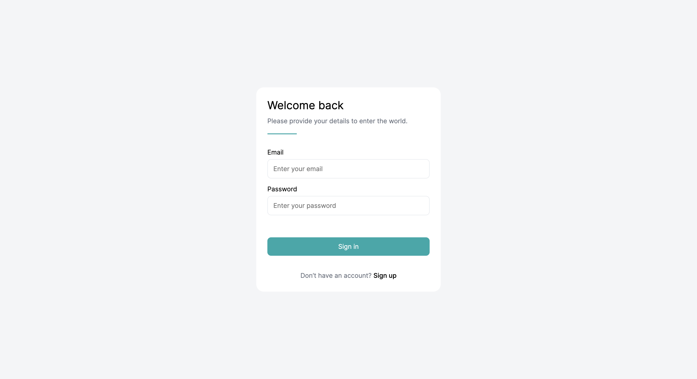    |    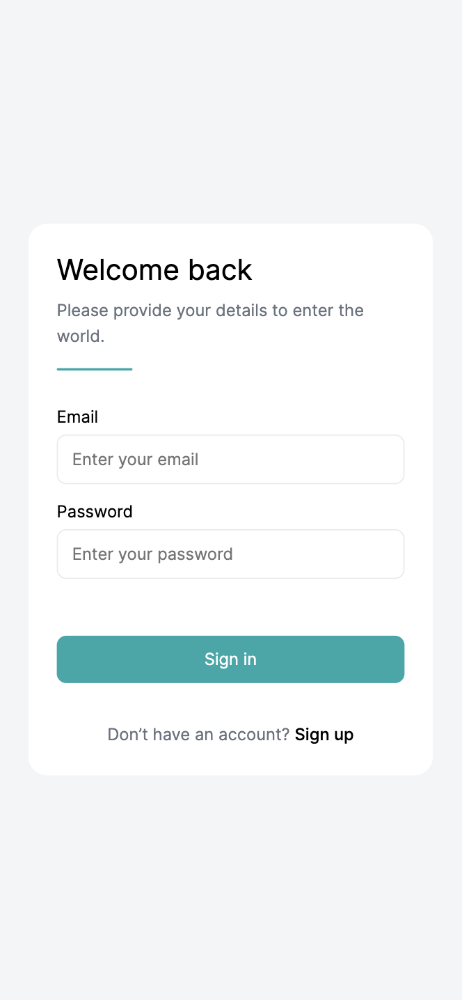    |
| 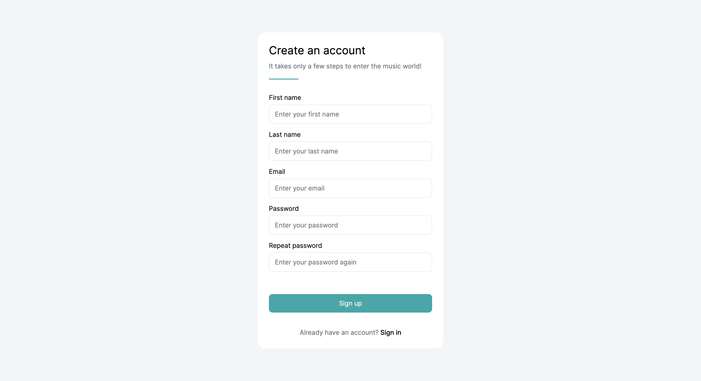 | 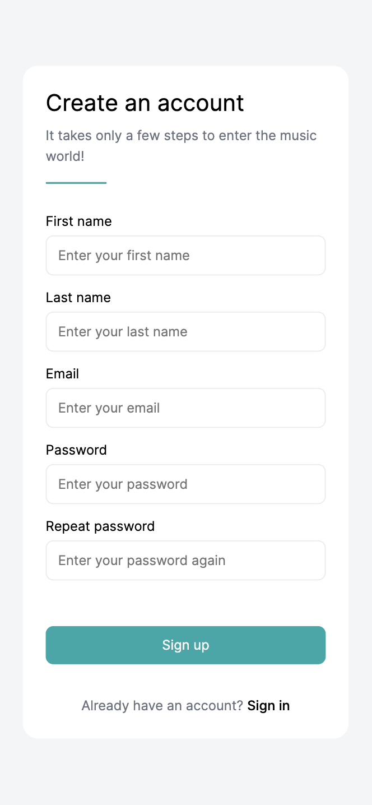 |

## Home / Dashboard

On Dashboard user can browse through all albums approved by admins that exists in the app. If he looks for a very
specific album, he can use a searching/filtering mechanism that works without page reloading. Additionally, each album
can be added to favorites albums by just clicking on heart icon on album tile.

|                       Desktop                        |                       Mobile                       |
|:----------------------------------------------------:|:--------------------------------------------------:|
| 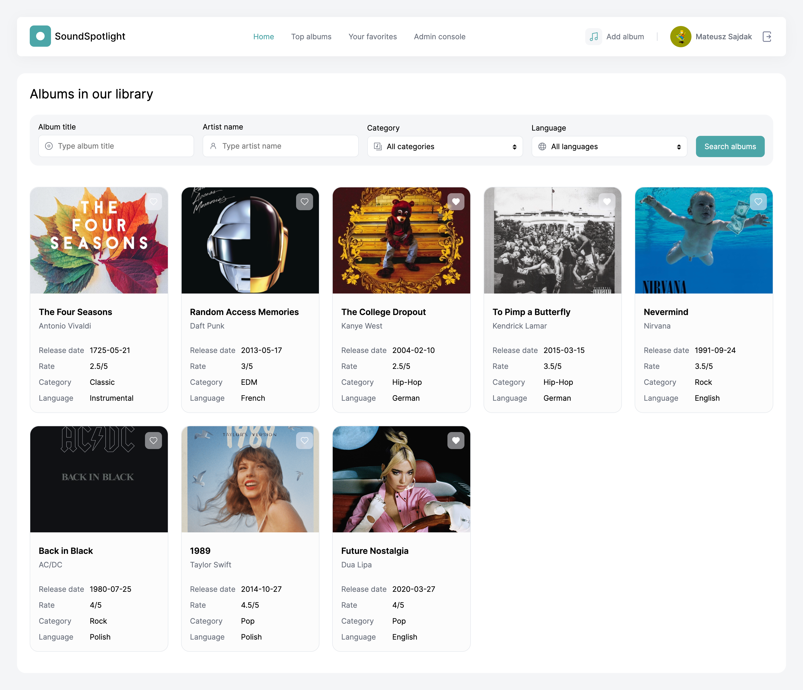 | 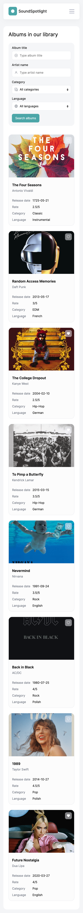 |

## Album details

When album paid user attention he can read something more about it, by going into album details. On this page user finds
more information rather than on album tile, like full descriptions, some numbers and others people opinions. Of course
user can add his own opinion too.

|                              Desktop                              |                             Mobile                              |
|:-----------------------------------------------------------------:|:---------------------------------------------------------------:|
| 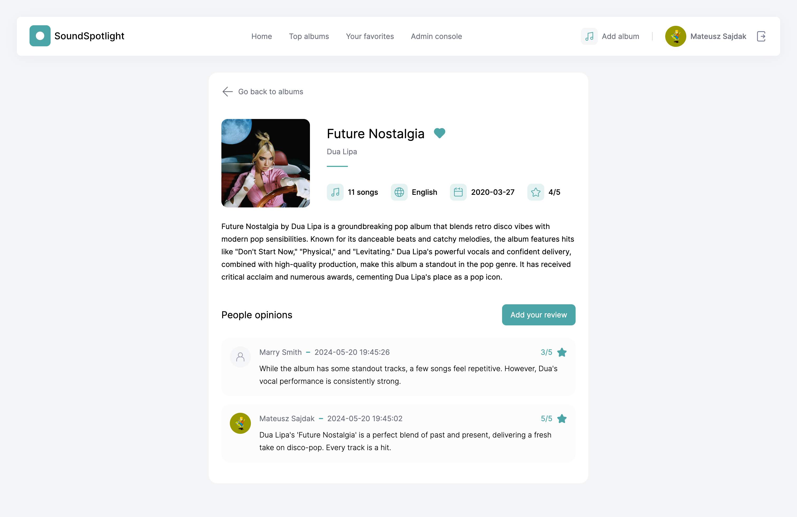 |  |

## Adding a review

Users can express their feelings about each album by leaving short comment and rate on scale from 1 to 5 stars.

|                           Desktop                           |                          Mobile                           |
|:-----------------------------------------------------------:|:---------------------------------------------------------:|
| 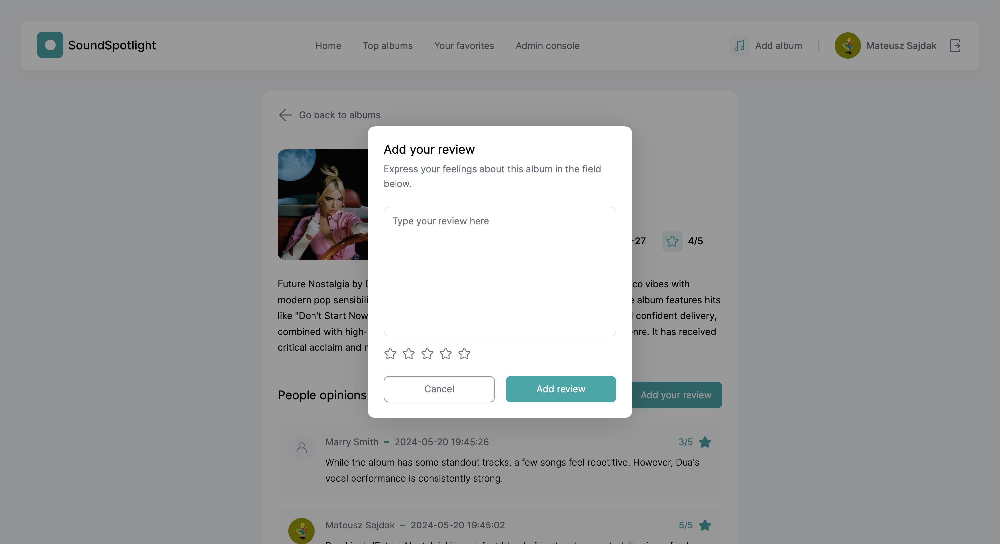 | 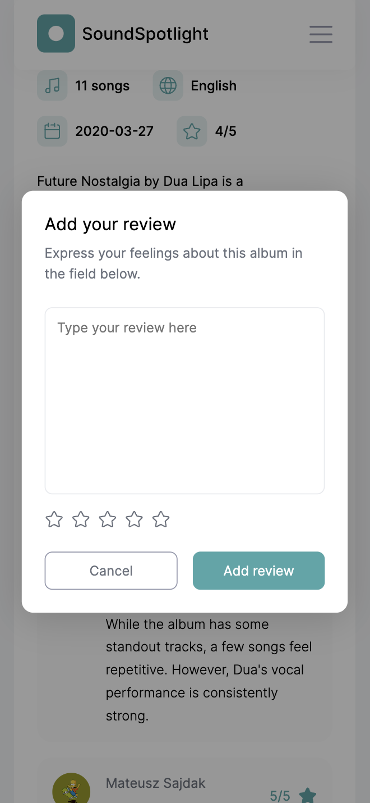 |

## Top albums

Based on albums ratings, SoungSpotlight prepares live refreshing rank with the 3 albums with the highest rates given by
people.

|                           Desktop                           |                          Mobile                           |
|:-----------------------------------------------------------:|:---------------------------------------------------------:|
| 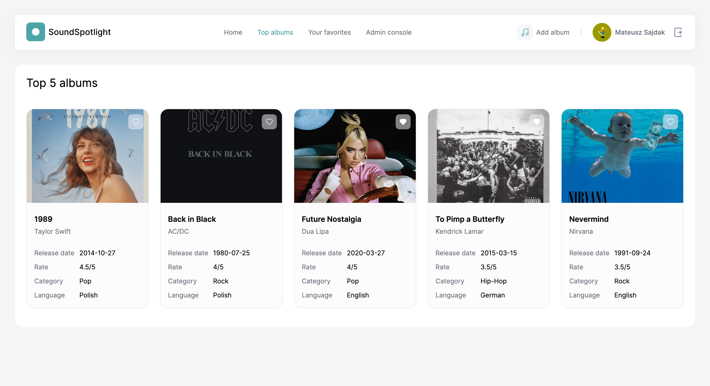 | 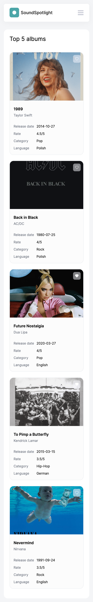 |

## Favorites

Your favorites albums always with you - thanks to dedicated place in SoundSpotlight where you can find albums that catch
your attention.

|                          Desktop                          |                         Mobile                          |
|:---------------------------------------------------------:|:-------------------------------------------------------:|
| 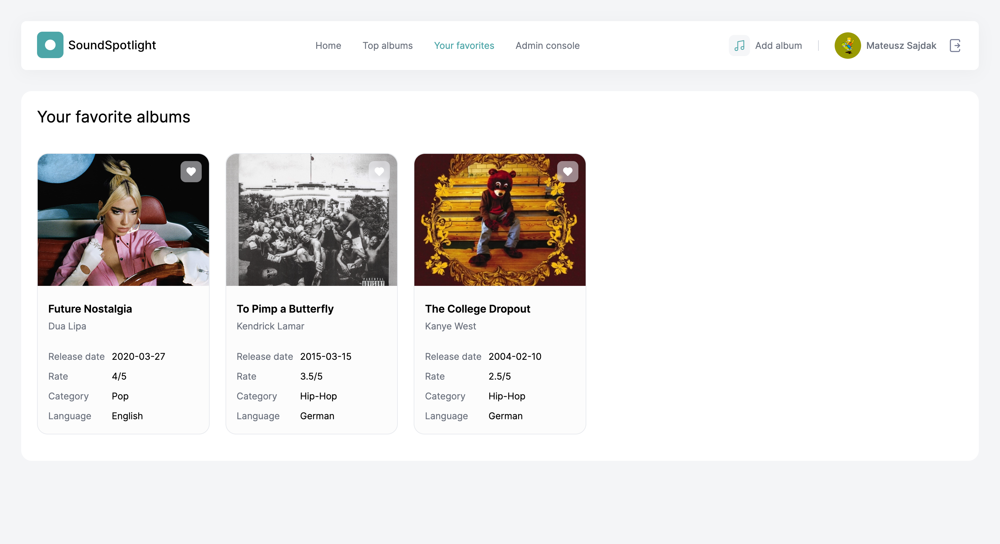 | 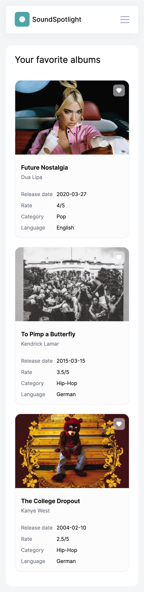 |

## User profile

In user profile users have an ability to take a look on their whole activity in the app like added reviews and albums.
Additionally, they can change avatar here - everyone love customisation.

|                                 Desktop                                 |                                Mobile                                 |
|:-----------------------------------------------------------------------:|:---------------------------------------------------------------------:|
|  | 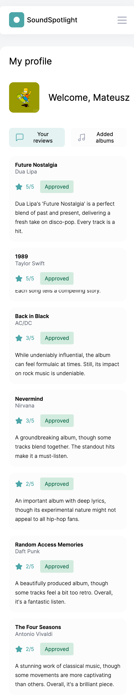 |
|   | 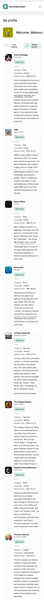  |

## Add album

User can be a contributor of the SoundSpotlight by adding his own (or not) albums. It is necessary to fill in only a few
fields and admin approval to see user's albums live.

|                          Desktop                          |                         Mobile                          |
|:---------------------------------------------------------:|:-------------------------------------------------------:|
| 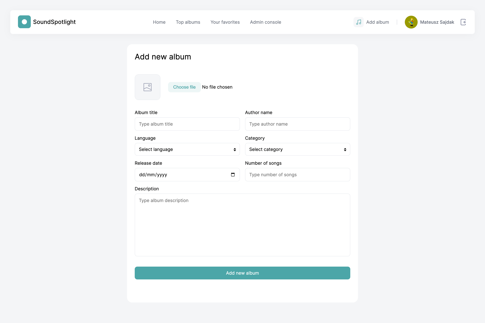 | 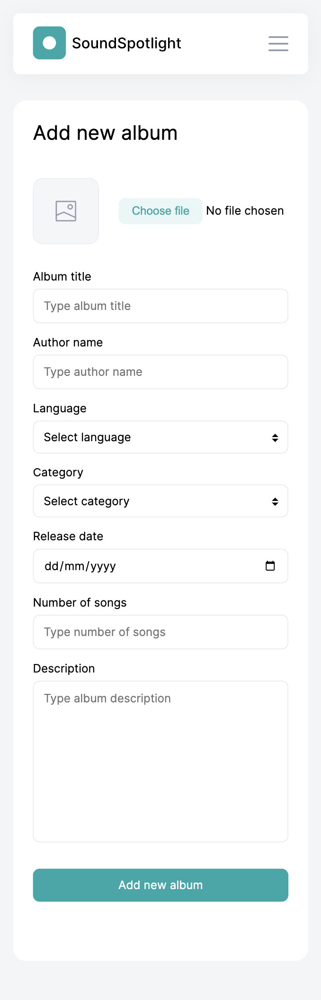 |

## Admin console

Whole environment should be clean and free from violence. Responsible people should take control over this, so this is
why there is admin role in the app. They can approve or reject albums and reviews. They have also a power to nominate
someone to become an admin or they can revert this decision.

|                                   Desktop                                   |                                  Mobile                                   |
|:---------------------------------------------------------------------------:|:-------------------------------------------------------------------------:|
| 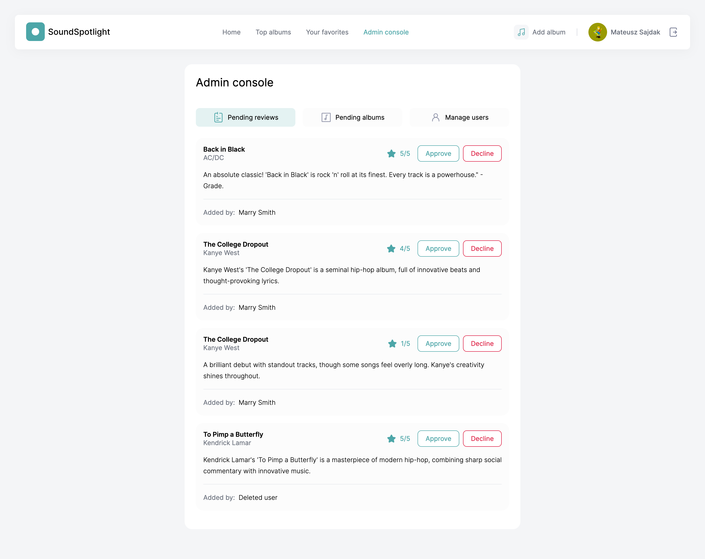 | 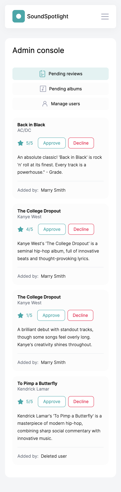 |
|    |  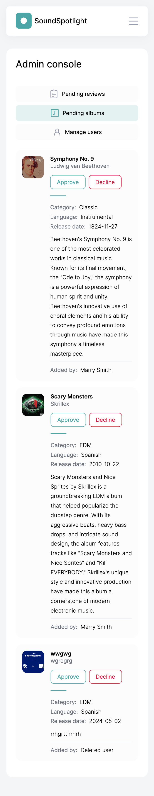  |
|   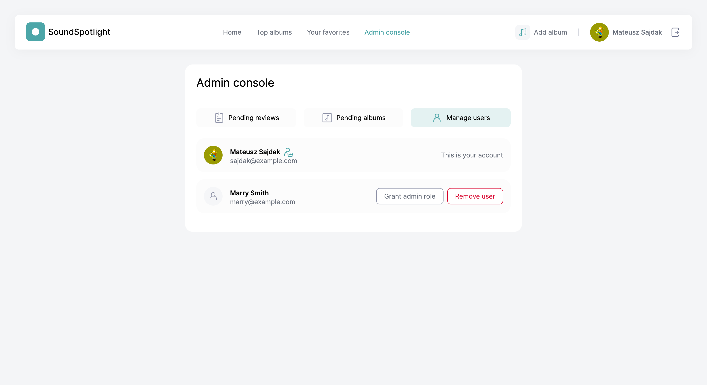    |   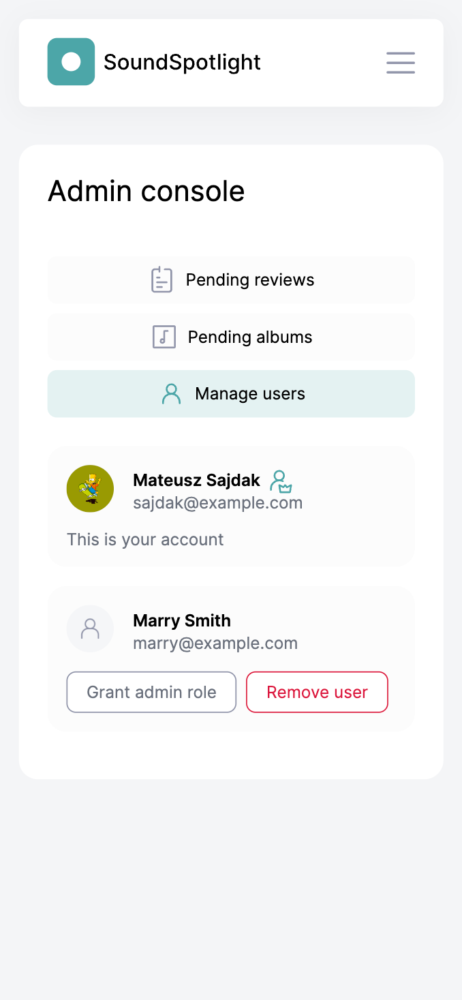    |

# Contact

### Mateusz Sajdak

**Email:** [sajdak.mateusz.219\@gmail.com](mailto:sajdak.mateusz.219@gmail.com) </br>
**Linkedin:** https://www.linkedin.com/in/mateusz-sajdak/ </br>
**Dribbble:** https://dribbble.com/mateuszsajdak </br>